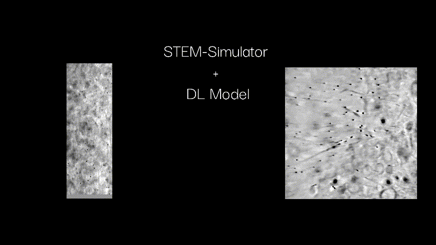

# Deep-EM Playground: Bringing Deep Learning to Electron Microscopy Labs

This codebase is part of the Deep-EM Playground. For more details, please see our [webpage](https://viscom-ulm.github.io/DeepEM/).


## 2D to 3D  

### Primary Focus: Tomographic Reconstruction   
### Application: Tomographic Reconstruction of STEM tilt series

#### Challenge: Evaluation with missing ground truth    
#### Required Labels: None

TL;DR 🧬✨ We use deep learning for tomographic reconstruction of 2D STEM projections, following [1,2]. This approach enables 3D volume reconstruction, revealing detailed cellular structures and relationships not visible in 2D.



---

[1] Kniesel, Hannah, et al. "Clean implicit 3D structure from noisy 2D STEM images." Proceedings of the IEEE/CVF Conference on Computer Vision and Pattern Recognition. 2022.

[2] Mildenhall, Ben, et al. "Nerf: Representing scenes as neural radiance fields for view synthesis." Communications of the ACM 65.1 (2021): 99-106.

## Setup

### Lightning AI
<a target="_blank" href="https://lightning.ai/hannah-kniesel/studios/deepem-template">
  
</a>

Start immediately using the Lightning AI Studio template by clicking the button above - no additional setup required. This will dublicate the studio in your own teamspace, allowing you to experiment with the code base.

### Local Setup 
For a quick setup, we offer the use of `conda`, `pip` or `docker`. This will provide all needed libraries as well as common libraries used for deep learning (for more details you can check `requirements.txt`). Of course you are free to install additional dependencies, if needed.  

#### Conda (LightningAI)
On your machine, run:
```bash
conda env create -f environment.yml
conda activate deepem_tomography
```

If you are working on [LightingAI](https://lightning.ai/) Studios, there will be a base environment, which you can update with the needed dependencies, by running: 
```bash
conda env update --file environment.yml --prune
```

#### Pip
When working with `pip`, please make sure you have a compatible python version installed. This use case was tested on `python == 3.12.5` with `cuda==12.1` and `cudnn9`.
Next, you can run
```bash
pip install -r requirements.txt
```

#### Docker
Build your own image with: 
```bash 
docker build -t deepem_tomography .
```
This will generate a docker image called `deepem_tomography`. 

or use the existing docker image from `hannahkniesel/deepem_tomography`. 

Start the docker with this command: 
```bash
docker run --gpus all -it -p 8888:8888 --rm --ipc=host -v /local_dir/:/workspace/ --name <container-name> <image-name> bash
```
For example the full command could look like this: 
```bash
docker run --gpus all -it -p 8888:8888 --rm --ipc=host -v "/Documents/DeepEM-Tomography/":/workspace/ --name deepem hannahkniesel/deepem_tomography bash 
```

Inside the container start `jupyter notebook`
```bash
jupyter notebook --ip 0.0.0.0 --no-browser --allow-root
```
Click on the link printed in the console to open the jupyter notebook in the browser.


## Citation

If you find this code useful, please cite us: 

    @inproceedings{
    }
